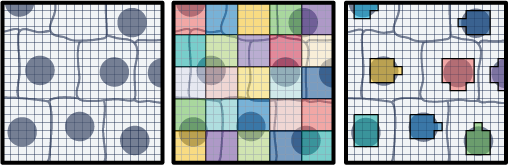

## Learning Objectives

By the end of this exercise, you will be able to:

-  TO DEFINE
<!-- TO DO: Adapt depending on the final data structure -->


## Libraries

```{r day1-1c-visium_HD_segmented-1}
#| message: false
#| warning: false
#| output: false

library(scuttle)
library(sf)
library(arrow)
library(dplyr)
library(tidyr)
library(ggplot2)
library(patchwork)
library(SpatialExperiment)
library(SpatialFeatureExperiment)
library(Voyager)
library(VisiumIO)
library(ggspavis)
library(HDF5Array)
```

Finally, we will work with the **Visium HD segmented output**. This data corresponds to the same sample and region of interest as the binned data from `Exercise 1A`, but instead of being binned, it contains the output of cell segmentation. Since Space Ranger version 4.0, the output of cell segmentation is available as an optional output of the pipeline, and it contains the coordinates of the segmented cells and their boundaries.

<!-- TO DO: we need to make a smaller version of the dataset for the course. Can it include the imgData as well?-->

```{r day1-1c-visium_HD_segmented-3}
options(timeout = 2000)

if (!dir.exists("data/segmented_outputs/")) {
  dir.create("data", showWarnings = FALSE)
  download.file(
    url = "https://cf.10xgenomics.com/samples/spatial-exp/4.0.1/Visium_HD_Human_Colon_Cancer/Visium_HD_Human_Colon_Cancer_segmented_outputs.tar.gz",
    destfile = "data/Visium_HD_Human_Colon_Cancer_segmented_outputs.tar.gz",
    mode = "wb"
  )

  untar(
    tarfile = "data/Visium_HD_Human_Colon_Cancer_segmented_outputs.tar.gz",
    exdir = "data/"
  )

  file.remove("data/Visium_HD_Human_Colon_Cancer_segmented_outputs.tar.gz")
} else {
  message("Data exists, please proceed to next steps!")
}
```

::: callout-important
## Exercise 1
- Which class do you think should be used to store the Visium HD segmented data? `SpatialExperiment` as we used in Exercise 1A or `SpatialFeatureExperiment` as we used in Exercise 1B?
- What does the data for each segmented cell represent? What is the binning strategy? What are the potential limitations?

::: 

::: {.callout-tip collapse="true"}
## Answer
- Since segmented data contains cell boundaries, the coordinates of the segmented cells are not limited to the spot coordinates as in the binned data. Therefore, we will use `SpatialFeatureExperiment` to work with the segmented data, as it allows us to store and visualize spatial features such as cell boundaries, as we did for the Xenium data in Exercise 1B. 
`SpatialExperiment` is more suitable for binned data where the coordinates correspond to the spot centroids on a regular grid and there are no additional spatial features to store.

- The Visium HD still captures the data on 2x2 µm bins. These are partitioned into larger bins based on the cell they correspond to (see Figure below). The partitioning of aggregated bins mimics single-cell data since the UMI counts are reported per segmented cell basis.



One limitation is that a bin can overlap than one cell, so the assignment of the transcripts captured would be ambiguous. Of course this approach relies also on the quality of the segmentation mask. 
::: 


Here we will proceed in two steps:
- We start reading the object into a `SpatialExperiment` object and subset it to the region of interest, as we have done for Visium HD binned data in the previous exercises. This allows a quick comparison of the two types of processing for the same slide
- We then convert the object to create a `SpatialFeatureExperiment` object and add the cell segmentation information to it/

```{r day1-1c-visium_HD_segmented-4}
# Read the segmented output into a SpatialExperiment object
spe_seg <- TENxVisiumHD(
  segmented_outputs = "data/segmented_outputs/",
  processing = "filtered",
  format = "h5",
  images = "lowres"
) |>
import()

rownames(spe_seg) <- uniquifyFeatureNames(
  ID = rowData(spe_seg)$ID,
  names = rowData(spe_seg)$Symbol
)

spe_seg
```

<!-- TO DO: use import function directly to SFE? Is this available in some package? Voyager package? -->

```{r day1-1c-visium_HD_segmented-5}
# Subset to the region of interest
roi_visium <- c(
  xmin = 49000,
  xmax = 58000,
  ymin = 7500,
  ymax = 16000
)
roi_visium

spe_seg <- spe_seg[, spatialCoords(spe_seg)[, 1] >= roi_visium[["xmin"]] &
  spatialCoords(spe_seg)[, 1] <= roi_visium[["xmax"]] &
  spatialCoords(spe_seg)[, 2] >= roi_visium[["ymin"]] &
  spatialCoords(spe_seg)[, 2] <= roi_visium[["ymax"]]]
```

<!-- Here we loose some metadata, for example the slot spe_seg$map which would allow us to calculate the cell area...)
--->

Load the previous binned object for comparison:

```{r day1-1c-visium_HD_segmented-6}
spe <- loadHDF5SummarizedExperiment(dir="results/day1/", prefix="01.1_spe_")
```

::: callout-important
## Exercise 2

- 1. Compare the number of features and spots in the segmented and binned objects. What do you observe?
- 2. Compare the `colData` of the two objects. What are the differences in the metadata columns? What do they represent?
- 3. Do you observe any other differences in the content of the objects? For example, in the `rowData` or the spatial coordinates?

:::

<!-- TO DO: Adapt the questions depending on the final order of exercises, add answers -->

```{r day1-1c-visium_HD_segmented-7}
spe_seg
plotVisium(spe, zoom=T)
plotVisium(spe_seg, zoom=T)

p_vis <- plotVisium(spe,
                    annotate = "PIGR",
                    assay = "counts",
                    zoom = TRUE,
                    point_size = 1,
                    point_shape = 22)

p_vis_seg <- plotVisium(spe_seg,
                      annotate = "PIGR",
                      assay = "counts",
                      zoom = TRUE,
                      point_size = 1,
                      point_shape = 21)
p_vis + p_vis_seg
```

Using visium HD segmented data allows us to have a more detailed view of the tissue, as we are not limited to the resolution of the bins. The x and y coordinates of the `SpatialExperiment` object corresponds to the centroids of the cells.

We can also have access to the full segmentation of the cells (i.e., the boundaries of each segmented cell), but contrary to the `SpatialFeatureExperiment`, this cannot be stored natively in a slot of the `SpatialExperiment` object, so it is stored in the `metadata` of the object.

In order to manipulate the segmentation in an easier way, we create a `SpatialFeatureExperiment` object, which allows us to store and visualize spatial features (e.g., see the `colGeometries()` function used in Exercise 1B). We need to add the cell segmentation boundaries to the list of geometries.

<!--TO DO: Adapt depending on the final order of exercises -->

```{r day1-1c-visium_HD_segmented-8}
sfe_seg <- toSpatialFeatureExperiment(spe_seg)
colGeometries(sfe_seg)

## Extract cell segmentation boundaries from the metadata
seg <- metadata(spe_seg)$cellseg
rownames(seg) <- metadata(spe_seg)$cellseg$cell_id

## Sort the segmentation similar to the order of cells in the SpatialFeatureExperiment object
i <- match(colnames(spe_seg), rownames(seg))
seg <- seg[i, ]

## Add the geometry to the object
colGeometries(sfe_seg)[["cellSeg"]] <- seg
colGeometries(sfe_seg)
```

<!-- TO DO? 
Julien: could be potentially nice to add the cell area, here is some code inspired from the OSTA book to do it. (But I admit it's not straightforward!) 

```{r}
## use the info in spe_seg$map (before subsetting)
map_by_cell <- spe_seg$map
map_by_cell <- map_by_cell[names(map_by_cell) %in% colnames(sfe), ]

## Otherwise get it with:  
download.file(
  url = "https://cf.10xgenomics.com/samples/spatial-exp/4.1.0/Visium_HD_11mm_Human_Colon_Cancer_Fresh_Frozen/Visium_HD_11mm_Human_Colon_Cancer_Fresh_Frozen_barcode_mappings.parquet",
  destfile = "data/segmented_outputs/Visium_HD_11mm_Human_Colon_Cancer_Fresh_Frozen_barcode_mappings.parquet",
  mode = "wb"
)
head(map <- read_parquet("data/segmented_outputs/Visium_HD_11mm_Human_Colon_Cancer_Fresh_Frozen_barcode_mappings.parque"))
map <- map[map$cell_id %in% colnames(sfe), ]
map_by_cell <- split(map, map$cell_id)


## Then:
idx <- match(colnames(sfe), names(map_by_cell))
sfe$map <- map_by_cell[idx] # list of tibbles

# percentage of segmented 2um bins
frac <- with(map, c(
    nuclear=mean(in_nucleus), 
    cellular=mean(in_cell)))
round(100*frac, digits=2)
#  nuclear cellular 
#     34.2    100.0 


# get cell area = 2x number of 2um bins
um2 <- 4*unlist(sapply(sfe$map, nrow))
sfe$um2 <- 0
sfe[, names(um2)]$um2 <- um2

# get fraction of 2um bins that are nuclear
sfe$nuc <- sapply(sfe$map, \(.) mean(.$in_nucleus))
# get nucleus areas = cell area x nuclear fraction
sfe$nuc_um2 <- sfe$um2*sfe$nuc

```
-->

We can visualize the geometries with a simple scatterplot, or these can be used in wrapper functions such as `plotSpatialFeature()` from the `Voyager` package:

```{r day1-1c-visium_HD_segmented-9}
plot(st_geometry(colGeometries(sfe_seg)[["centroids"]]), 
     col=rep(colors(), 2), 
     pch=16)

plot(st_geometry(colGeometries(sfe_seg)[["cellSeg"]]), 
     col=rep(colors(), 2), 
     lty=0)

## Plot the expression of PIGR on each segmented cell
plotSpatialFeature(sfe_seg, 
                   colGeometryName="cellSeg", 
                   features="PIGR", 
                   exprs_values = "counts") 
```  
:::

::: callout-important
## Exercise 3
Plot the cell segmentation mask of very small region of interest on the slide, for example:

```{r day1-1c-visium_HD_segmented-10}
roi_zoomed <- c(
  xmin = 54500,
  xmax = 55000,
  ymin = 12500,
  ymax = 13000
)
```
What do you observe?
::: 

::: {.callout-tip collapse="true"}
## Answer

```{r day1-1c-visium_HD_segmented-11}
sfe_zoomed <- sfe_seg[, spatialCoords(sfe_seg)[, 1] >= roi_zoomed[["xmin"]] &
                        spatialCoords(sfe_seg)[, 1] <= roi_zoomed[["xmax"]] &
                        spatialCoords(sfe_seg)[, 2] >= roi_zoomed[["ymin"]] &
                        spatialCoords(sfe_seg)[, 2] <= roi_zoomed[["ymax"]]]

plot(st_geometry(colGeometries(sfe_zoomed)[["cellSeg"]]), 
     col=rep(colors(), 2), 
     lty=0)
rm(sfe_zoomed)
```

When zooming in, we can clearly see that 2 um bins make up each cell in the dataset.
:::


Save the object
```{r day1-1c-visium_HD_segmented-12}
saveHDF5SummarizedExperiment(sfe_seg,
  dir = "results/day1", prefix = "01.1_sfe_visium_", replace = TRUE,
  chunkdim = NULL, level = NULL, as.sparse = NA,
  verbose = NA
)
```

<!--
TO DO: Even using this, some out-of-memory components break when re-importing because the original file is unavailable or is tied to some absolute path. E.g., 

Error in (function (cond)  : 
  error in evaluating the argument 'x' in selecting a method for function 'colData': external pointer is not valid

Another (better) way to save the object would be to use the alabaster.sfe package, but I failed to install it on my Mac...

```{r}
fsave <- file.path("results/day1", "01.1_sfe_visium")
alabaster.sfe::saveObject(sfe_seg, fsave)
dir_tree(fsave)
```
-->

For the rest of the exercises, we will use this Visium HD segmented object, but feel free to replace by the binned object (`Exercise 1A`) or the Xenium object (`Exercise 1B`) to compare the results.
 